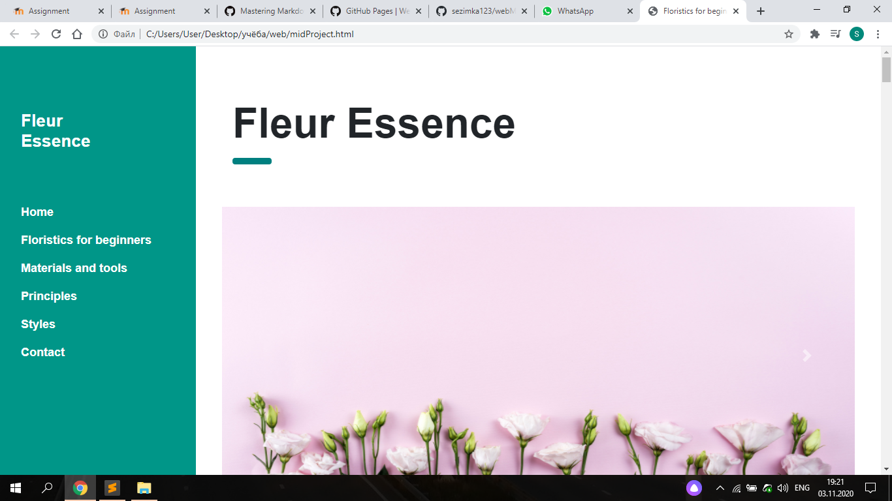
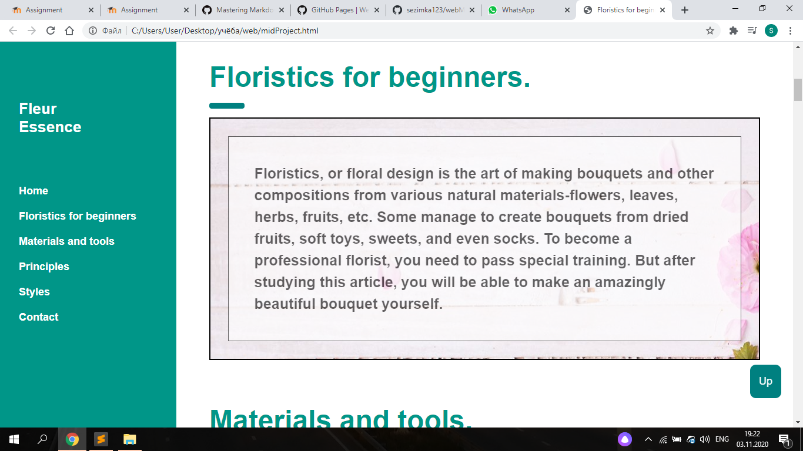
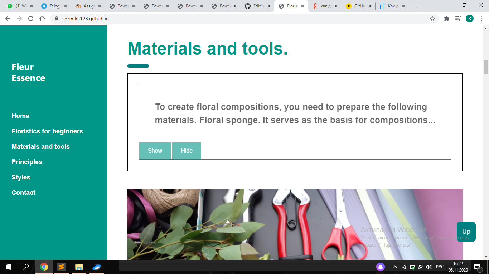

# Fleur Essence
This is my website-tutorial which teaches how to create bouquets and other compositions from various natural materials-flowers, leaves, herbs, fruits, etc.
There are also a lot of important and interesting information about floristics.

